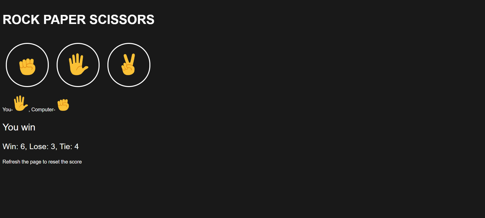

# Rock-Paper-Scissors Game

A fully interactive **Rock-Paper-Scissors** game built using **HTML**, **CSS**, and **JavaScript**.  
You can play against the computer, track your wins/losses/ties.

---

## Screenshot  

---

## Features

### Core Features
- Simple, clean, and responsive interface  
- Three interactive player choices: **Rock**, **Paper**, **Scissors**  
- Randomized computer move generation  
- Live score tracking:
  - **Win**
  - **Lose**
  - **Tie**

---

## Project Versions
This version includes:
- `index.html` (game page)
- Buttons for player moves
- Game logic with live scoring
- No data persistence — score resets on refresh

---

## Implementation Guide
- See [implementation_guide.md](implementation_guide.md) for how to run the project.

---

## Technologies used
- HTML5
- CSS
- JavaScript

---

## Author
**Surya Gudipati**

> *UI inspiration taken from the SuperSimpleDev version of this game.*
