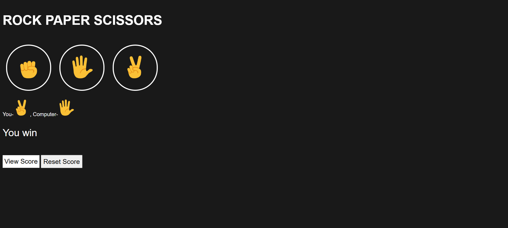
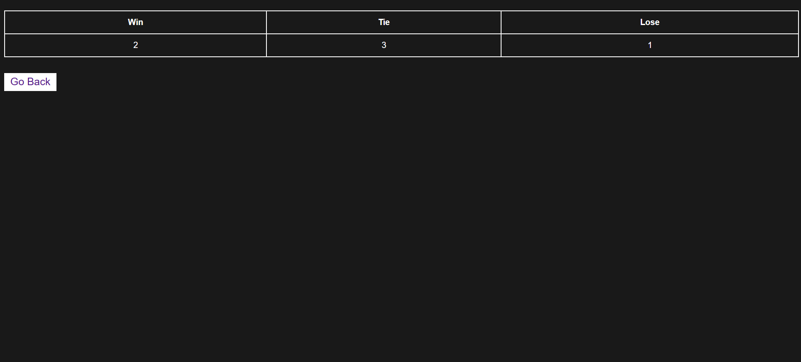

# Rock-Paper-Scissors Game

A fully interactive *Rock-Paper-Scissors* game built using *HTML, **CSS, and **JavaScript*.  
You can play against the computer, track your wins/losses/ties, and view your saved results on a separate page using localStorage.

---

## Screenshot   

---

## Features

### Enhanced Version Features
- A dedicated **Results Page (results.html)**  
- Automatically displays:
  - Total Wins  
  - Total Losses  
  - Total Ties  
- Scores are saved using *Browser LocalStorage*  
- “View Results” button directly from the game page  

---

## Project Version

This version includes everything in the Basic Version *plus*:
- results.html (score summary page)
- Persistent score storage using localStorage
- A “View Results” button on the game interface
- Ability to manually reset score

---

## Implementation Guide
- See [implementation_guide.md](implementation_guide.md) for how to run the project.

---

## Technologies used
- HTML5
- CSS
- JavaScript

---

## Author
*Surya Gudipati*
